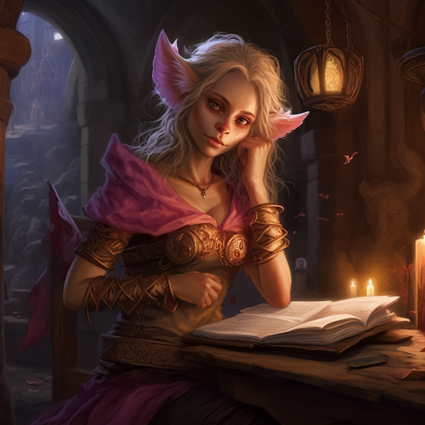
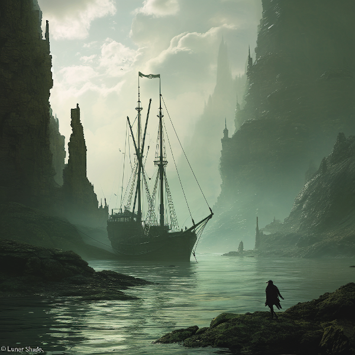
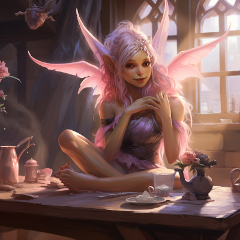
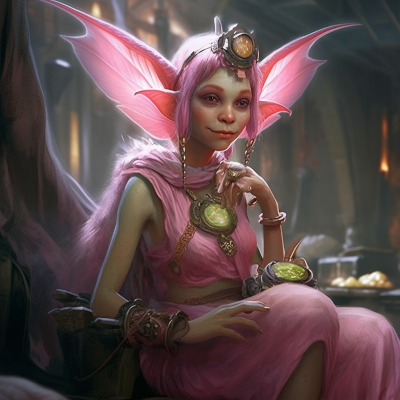
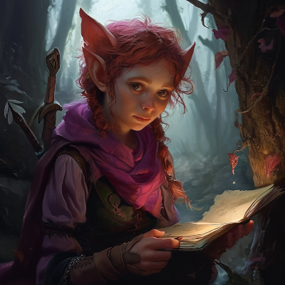
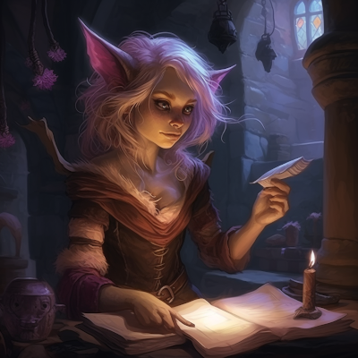
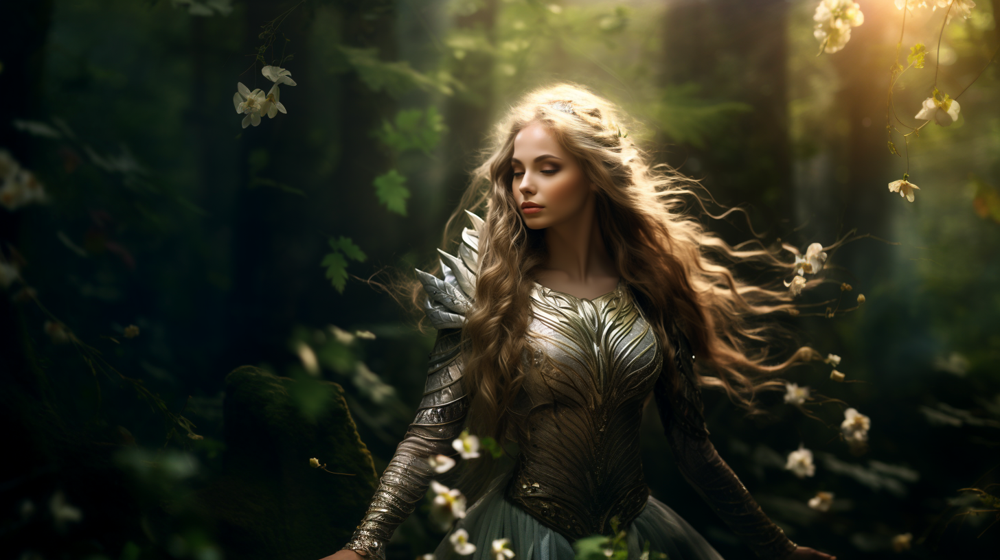
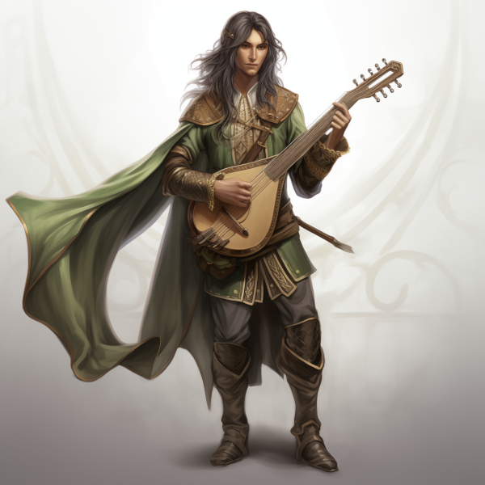

# AI-Driven Content Creation Suite 

---

# Table of Contents

1. [Prompt Engineering - Content Creation suite](#Overview)
2. 
3. [NPC Cleo](#Cleo) 
4. [Cipher Scrolls Quest 1 - Explore Hainir's Cave System](#Quest_1)
5. [Cipher Scrolls Quest 2 - Deep Dive Ghaldassii Ruins ](#Quest_2) 
6. [The Pantheon Race of Feylindar](#Feylindar)
7. [Elyndria - Daughter of the Infinite Union](#Elyndria)
8. [Janis Sova, Lord of Owls profile and internal monologue](#Janis_Sova)
     
9. [NPC Elandil - "The Lute Player"](#Elandil)

10. [Prompt Engineering Python code](https://github.com/timo242/AI-Prompt-Engineering/blob/main/cleo_cipher_scroll_q1.ipynb)

---

# Overview

**Portfolio Overview:**

My development portfolio showcases a comprehensive suite designed to revolutionize ontent creation through its broad scope and multifaceted functionality. Here's a detailed look at what I've developed and can offer to a company:

**Multi-Faceted Content Generation**: My tool goes beyond traditional boundaries, adeptly crafting immersive stories, detailed item descriptions, character backstories, and more. Each content piece is meticulously tailored to enrich the RPG world, adding unparalleled depth and variety.

**Efficient Lore and Data Integration**: Harnessing Python's robust capabilities, I've engineered a system that seamlessly manages and integrates complex game lore. This innovation significantly reduces AI token usage while enriching content with lore depth, striking a balance between narrative quality and computational efficiency.

**Dynamic and Contextual Storytelling**: Utilizing OpenAI's GPT-4, my suite offers dynamic storytelling, ensuring content is contextually aligned with the game's world and characters. This approach ensures a unique and engaging player experience, bringing each interaction to life.

**Structured Data Management**: I prioritize organization and efficiency; thus, all generated content is neatly formatted into JSON for effortless integration into game development workflows, simplifying content management and implementation.

**Customizable and Scalable**: Designed for adaptability and scalability, my suite can handle an extensive range of content types and accommodate complex narrative structures, maintaining effectiveness and efficiency.

**Key Advantages:**

- **Diverse Content Creation**: Capable of generating a wide variety of content, significantly enhancing game narrative and depth.
- **AI Efficiency**: Optimizes processing costs through strategic lore encapsulation, promoting faster and more economical operations.
- **Creative Versatility**: Provides a flexible canvas for various content types, encouraging creative exploration.
- **Practical and Organized**: Streamlines the content management process, an essential aspect of game development and storytelling.

**Ideal Application:**

- **Comprehensive Game Development**: An invaluable asset for RPGs requiring rich and varied narrative content.
- **Interactive Storytelling and World-Building**: A perfect tool for creators eager to incorporate AI innovation into their storytelling arsenal.
- **Efficiency in AI Narrative Generation**: A testament to using AI effectively for diverse content creation while optimizing resource usage.

In essence, my portfolio represents the cutting-edge intersection of creativity and technology, offering tailored solutions that propel narrative gaming experiences to new heights. Whether for enhancing game development or pioneering interactive storytelling, my work stands as a testament to innovation and efficiency in the realm of AI-powered content creation.

#### Technologies Used

- **Python:** For scripting, AI interactions, and data management.
- **Jupyter Lab** A web-based interactive development environment for notebooks, code, and data.
- **OpenAI's GPT-4:** Advanced AI engine for diverse narrative generation.
- **JSON:** Efficient format for data structuring and export.
- **Midjourney:** Storyboard Visualization using optimized lore narratives.

---
---

#### My_Journey
"This work is a creative tapestry, carefully woven by blending the publicly available lore of [Visionary Realms' 'Pantheon: Rise of the Fallen'](https://www.pantheonmmo.com/) with a stroke of artistic invention. It aims to underline the profound capabilities of prompt engineering with ChatGPT 4.0, emphasizing its potential to generate rich and compelling fictional realms. Moreover, it stands as a reflection of my own creative journey, showcasing my proficiency and forward-thinking in developing immersive content. Throughout this endeavor, I've engaged deeply in writing, yet the essence of 'Prompt Engineering for Creative Fiction' positions me akin to both an Engineer and Director, orchestrating the narrative as AI takes the lead as the principal performer.  This project is not just an exploration of AI's narrative potential, but a harmonization of the original Pantheon Lore with my unique interpretative vision, using AI as a dynamic and integral component of the creative process.  The human touch, embodying both emotion and creativity, remains irreplaceable in the creative process. AI, devoid of genuine feeling or inventiveness, relies on the human spark to seed and guide its narratives, ensuring that the stories resonate with authentic emotional depth and imaginative flair." 

---

### "NPC Characterization and Quest Interaction - Tailored Dialogue Based on Race and Class"

>This [Prompt Engineering Python code](https://github.com/timo242/AI-Prompt-Engineering/blob/main/cleo_cipher_scroll_q1.ipynb) is a sophisticated RPG Content Creation Suite designed to automate and enrich the dialogue and quest creation process in role-playing games. By leveraging OpenAI's GPT-4, it generates dynamic, lore-rich dialogues tailored to each player's race and class, providing a deeply personalized gaming experience. This not only elevates the narrative depth and immersion for players but also significantly frees up creative writers from the time-consuming task of crafting individual NPC dialogues, allowing them to focus on broader story arcs and world-building. The suite represents a blend of technology and creativity, pushing forward the capabilities of interactive storytelling in gaming.

---

# Cleo
 

---

### Meet the NPC "Cleo" Feylindar Historian... of sorts.... 

>Cleo is a captivating figure residing in the secluded Halnir's Cave, embodying the enchanting 
    characteristics of her [Feylindar](#Feylindar) heritage. Her ethereal beauty retains its distinctive markers with pink furry ears
    and a constellation of freckles across her skin, suggesting a rich blend of elf and fey traits. 
    Cleo's charm is not just in her appearance but in her sharp intelligence and quick wit, which she employs alongside her 
    innocent façade to navigate and manipulate the world around her.  Despite her playful and flirty demeanor, there's a shrewd 
    and calculating mind beneath her exterior, ready to wield her blades with precision if the situation demands. Her education 
    in elven traditions and street smarts akin to a rogue allows her to tread treacherous paths with an air of effortless grace. 
    Known for her ability to turn situations to her advantage, Cleo's appearances are always enveloped in a mix of danger and intrigue.  Though she may be at times a reluctant quest
    giver, her interactions are always intricately laced with charm and strategy, ensnaring those who 
    cross her path into her complex webs. Her tendency to give adventurers pet names adds to her enigmatic allure, 
    making each encounter with her a memorable blend of risk and fascination. Cleo remains a figure of mystery and allure, 
    a testament to the rich and varied tapestry of the Feylindar heritage.

## note:

Quest 1 json file is [here](https://github.com/timo242/AI-Prompt-Engineering/blob/main/cipher_scrolls_q1.json).
Quest 2 json file is [here](https://github.com/timo242/AI-Prompt-Engineering/blob/main/ghaldassii_cipher_scrolls.json))

---
# Quest_1

### Cipher Scrolls Quest 1 - Explore Hainir's Cave System 
> In the shadowy depths of Halnir's Cave, the adventurer encounters Cleo, engrossed in ancient tomes. She is on a quest to uncover the legendary cipher scrolls, believed to hold the secrets to Drak’Elri, the language of dragons. Eager to unlock these ancient wisdoms, Cleo persuades the adventurer to join her in this perilous endeavor. She believes that the scrolls, hidden within the cave and possibly beyond, offer a key to untold knowledge and power. Cleo's proposal weaves together danger, the allure of forgotten lore, and the promise of a journey into the heart of ancient dragon mysteries.

| Race / Class | Quest Dialog |
|----------|-----------|
| Gnome/Enchanter |As the adventurer steps further into the dimly lit expanse of Halnir's Cave, a soft, melodic voice resonates through the cavern, drawing them forward. The source of the siren call is revealed to be none other than Cleo, the enchanting Feylindar, lounging amidst a stack of ancient tomes and scrolls.  "Well, well, what brings a curious traveler like yourself to the depths of this forgotten place?" Cleo's tone is light, playful, yet there's an edge of sharpness to it, like the blade of a finely honed dagger. Her eyes, reminiscent of twilight skies, lock onto you with an intensity that belies her carefree demeanor.  "Ah, a Gnomish enchanter," she purrs, a smile dancing upon her lips. "A master of the arcane, a weaver of minds. Just the sort of companion I need for a little venture of mine." Cleo rises gracefully, her movements a ballet of purpose and seduction as she circles you, appraising you with a keen eye.  "You see, my inquisitive friend," she continues, "I am in pursuit of something... exceptional. Legendary cipher scrolls that are said to contain the secrets to translating the language of Drak’Elrin—the very tongue of dragons. Can you imagine the power held within those writings?"  Her fingers trace the edge of a scroll, and her gaze meets yours with an intensity that borders on hypnotic. "The Enchanter, with a single word, bends wills and shapes destinies. And you, my ethereal traveler, with your mastery of order amidst chaos, are uniquely suited to aid me in this quest."  Leaning in close, the scent of wildflowers and ancient parchment mingling in the air between you, she whispers, "Imagine the glory, the knowledge, the sheer thrill of unlocking such ancient, hidden truths. And let's not forget the rewards that come with such discoveries."  With a playful wink, she adds, "This could be the beginning of a very beautiful and lucrative relationship, don't you agree? All of my partnerships are, after all."  Cleo steps back, allowing you a moment to consider her proposal. "What say you, little enchanter? Will you join me in unraveling the mysteries that have been lost to the ages? Will you help us claim our place in this Frail Age, and perhaps... turn the tides of our shared destiny?"  Her question hangs in the air, a tantalizing invitation that beckons you towards adventure, danger, and the allure of the unknown.
| Gnome/Rogue |In the dimly lit chamber of Halnir's Cave, where the air is thick with the dust of untold ages, you notice the silhouette of Cleo poring over ancient tomes. Her pink ears twitch in your direction as you approach, aware of your presence long before you make a sound. She looks up from her studies, her eyes reflecting a playful mischief that belies the gravity of her scholarly pursuits.  "Aha, what have we here? A traveler of the shadows graces my secret sanctum," she says with a sly grin. "Tell me, little traveler, are you as adept at unraveling mysteries as you are at slipping unseen through the night?"  She stands and stretches, her form as graceful as the tales suggest, and walks toward you with a dancer's poise.  "I am in need of a partner for a rather... delicate endeavor. You see, I am on the cusp of uncovering the secrets of the cipher scrolls, which hold the key to translating Drak’Elri, the language of dragons. And what does that mean, you ask?" Cleo pauses for dramatic effect, her voice dropping to a whisper. "The Dragon Accords, my friend. Imagine the power, the knowledge, that could be at our fingertips!"  She circles you, her gaze appraising. "Your kind, the Gnomes of the arcane Skyhold, are no strangers to the allure of ancient wisdom. And a rogue's skill set could prove quite... invaluable in the challenges ahead."  She stops before you, her eyes locking with yours. "Think of it, my ethereal associate—the treasures we could uncover, the history we could rewrite! Not to mention the wealth and prestige that accompany such discoveries. I can assure you that an alliance with me is most... rewarding."  Cleo extends a delicate hand, a scroll unfurling between her fingers like the petals of a rare bloom.  "So, what say you? Shall we embark on this quest together? Let's begin with the enigmas lurking within Halnir's depths and then set our sights on the world beyond. Do we have an accord, little traveler, or will you let this once-in-a-lifetime opportunity slip through your fingers like the sands of time?"  Her offer hangs in the air, tantalizing and pregnant with the promise of adventure, waiting for your response.|
| Dark Mry/Warrior |In the cool, murmuring shadows of Halnir's Cave, the air still with ancient secrets, the Dark Myr warrior's presence seemed almost sacrilegious amid the silence. But there she was, Cleo, the Feylindar whose very essence was woven into the cavern's tapestry of mysteries. She turned, a playful smile dancing on her lips, her pink, furry ears twitching with intrigue at the sight of the formidable Myr before her.  "Well, well, what have we here? A traveler from the depths, I see," she teased, her voice a melody that belonged to the winds above and the roots below. "A warrior of the Dark Myr, no less. How rare and delightful that the tides have brought you to my hidden sanctum."  The adventurer watched her with a quiet intensity, and Cleo's gaze sparkled with the allure of unshared knowledge. "You've ventured far from the ocean's embrace, Dark Myr," she continued, her eyes scanning the warrior's formidable form. "But I suspect the currents of fate have carried you for a reason. You seek purpose, power, maybe even redemption for your proud people. How... ambitious."  Her slender fingers traced the air as if weaving an invisible thread, and her next words carried the weight of history itself. "I have a task, one of such importance that I've kept it cloaked in the shadows, away from prying eyes. You see, there are scrolls, cipher scrolls, veiled in the language of dragons—Drak’Elri. Their secrets could unlock the Dragon Accords, a door to power untouched since the time of Rok’Nhilthamos."  Cleo stepped closer, the scent of ancient parchment and magic clinging to her. "Imagine, warrior, the glory that would shower upon those who decipher such knowledge. The strength of the Myr is legendary, but with the wisdom of dragons? You would be... unstoppable."  A sly grin crossed her lips, her tone dropping to a conspiratorial whisper. "But such quests are not for the faint of heart, nor the dull of blade. I need an adventurer of your caliber, someone who defies the limits of physical strength and the boundaries of this fragmented world."  She extended her hand, palm up, as if offering the very world to the Dark Myr. "Join me in this dance of destiny. Retrieve the cipher scrolls from the secret depths of Halnir's Cave, and then... who knows what wonders we might chase across Terminus?"  Her expression softened, a genuine respect for the warrior before her seeping through. "Your name will be etched in the annals of the Keepers, sung by the winds across the seas. What say you, traveler? Shall we embark on a journey that could redefine the future of our world?"  Cleo's eyes held a promise, a glint of shared triumphs yet to come. "This could be the beginning of a very beautiful and lucrative relationship, my dark-tided warrior. All my associations tend to blossom into... well, let's just say they're quite rewarding."  The Dark Myr warrior stood contemplative, the weight of their people's past pressing upon their shoulders, the promise of power and legacy beckoning from Cleo's outstretched hand. The choice was theirs to make, to dive once more into the unknown for the chance to grasp the threads of history and weave them anew|
| Dark Mry/Rogue|In the shadowy recesses of Halnir's Cave, the air is thick with the scent of ancient parchment and the quiet drip of distant underground streams. Here, amidst the forgotten relics of a bygone era, you find Cleo, her figure half-illuminated by the flickering light of a single candle. The playful spark in her eyes betrays her excitement at your arrival.  "Ah, the Dark Myr rogue emerges from the shadows," she coos with a sly grin, her voice both a caress and a dance. "How fitting for one such as yourself to find my secret haven. Tell me, traveler, do the depths of the ocean hold whispers as intriguing as the secrets buried in these tombs?"  She motions around the chamber, her fingers brushing against the spines of ancient books as if they were delicate treasures. With a graceful pirouette, Cleo faces you fully, her pink ears twitching with each subtle sound.  "I'm in pursuit of a legend, dear shadow-walker," she confides, her tone lowering to a conspiratorial whisper. "The cipher scrolls, ancient texts rumored to hold the key to translating Drak’Elri, the language of dragons. Imagine the power, the knowledge that could be ours if we could but speak with the wisdom of those majestic beasts!"  Cleo steps closer, the scent of wildflowers and old leather mingling in the air between you. "I need someone of your... particular skills. Someone who can slip unseen, who understands the allure of a secret longing to be uncovered."  She extends her hand, a parchment unrolling between her fingers to reveal a contract written in elegant script. "This is but the beginning, my intrepid adventurer. Together, we could unravel the mysteries of the Dragon Accords and perhaps discover fortunes untold. What do you say?"  Her eyes sparkle with the promise of adventure and the thrill of the unknown. "Will you join me in this dance of discovery? Will you be the blade in the dark that helps carve a path to history's heart?"  Cleo offers you a chance to become part of something greater, an open-ended contract that starts with the depths of Halnir's Cave and extends to the world beyond. She hints at the beautiful and lucrative relationship that awaits those who choose to become her "associates."  "Take your time, darkling of the deep," she purrs, a playful smile playing upon her lips. "But know this—the tides of fate wait for no one, and neither do I."|
| Halfling / Rogue |As you carefully navigate the winding paths of Halnir's Cave, a gentle light beckons you forward. There, in a chamber veiled by the shadows of forgotten eras, you find her. Cleo, the Feylindar, sits amidst a scattering of ancient tomes, her figure illuminated by the ambient glow of enchanted crystals. Her pink, furry ears perk up as she catches the silent shuffle of your footsteps.  With a playful tilt of her head, she regards you, a mischievous smile playing at the corners of her mouth. "Ah, a curious little traveler, aren't you? A halfling with the lightness of foot and the sharpness of mind, I presume," she says, her voice a melody that weaves through the air like a gentle breeze.  You step closer, intrigued by the clandestine meeting and the enigmatic figure before you. Cleo rises, her movements a fluid dance, as she begins to circle you, assessing your potential with a keen eye. "In the tapestry of Terminus, every thread has its place, and I've a feeling you're just the rogue I need to unravel a particular mystery."  She stops, her eyes locking onto yours with a knowing gaze. "I'm in search of something... lost. The cipher scrolls, they call them. Legends whisper they hold the key to the language of dragons, Drak’Elri. Imagine the doors that could open with such knowledge—the Dragon Accords themselves, perhaps."  A soft chuckle escapes her as she leans in, her words a tantalizing promise. "What say you, little sneak? Will you dare the depths of Halnir's Cave with me? We could make history together—or at least, make our purses a bit heavier."  Cleo extends her hand, a silent offering of partnership. "Consider this an open-ended contract, with treasures and secrets ripe for the taking. Not just here, but in the world beyond. And let me assure you, my dear adventurer, alliances with me tend to be... remarkably rewarding."  Her eyes hold a glint of adventure, a spark that ignites the wanderlust in your heart. You realize that this is no ordinary quest. It's a call to step into the unknown, to be part of a story that could change the very fabric of Terminus.  So, will you accept the offer of the Feylindar historian, the keeper of mysteries, and step into a partnership that could lead to wealth, wisdom, or perhaps, something even greater?|
| Archai / Shaman |In the cool, shadowy recesses of Halnir's Cave, where the air hums with the weight of forgotten lore, you—the Archai Shaman—feel the ancient energies intertwine with your own. A sudden flicker of movement catches your eye, and there she stands: Cleo, the enigmatic Feylindar, her constellation-like freckles shimmering in the dim light.  As your gaze meets hers, her lips curl into a playful smile, and her voice, melodious yet laced with intrigue, breaks the silence. "Well met, Traveler of the Elemental Spirits. It's not every day that one witnesses an Archai Shaman wandering the halls of antiquity."  You incline your head, acknowledging her presence, your elemental-bonded senses already picking up the latent magic that seems to cling to her very being.  "Oh, do not be so formal, dear Traveler," Cleo teases, her pink ears twitching as if amused by your solemnity. "I promise, I'm not one of those cryptic entities who speak in riddles and half-truths. Well, not today, at least."  She glides closer, her movements a testament to the grace of her heritage. "You see, I am on the cusp of deciphering a legend as old as the Reignborn themselves—the cipher scrolls of Drak’Elri. They whisper of a way to translate the Dragon tongue, and with it, the key to unlocking the mysteries of the Dragon Accord."  Her eyes gleam with a fervor that only a true historian could possess. "Imagine the power and wisdom hidden within those ancient words. But alas, I am bound to this place, my research requiring a delicacy... and a certain freedom of movement I currently lack."  Cleo extends a delicate hand, almost as if offering the very world to you. "This is where you, my fierce and vibrant Archai, come into play. I propose an open-ended contract, a partnership that will begin with the unexplored depths of this very cave. And should you prove as capable as the spirits claim, it may just extend to the farthest reaches of Terminus."  She steps back, her proposition hanging in the air like the subtle scent of magic. "What say you, Shaman? Will you brave the unknown and seek out the cipher scrolls for Cleo? I assure you, the rewards will be as enriching as the journey itself. And who knows, it could be the start of a most... lucrative camaraderie."  Her offer is clear, the promise of adventure and knowledge almost palpable. Now, it is for you to decide whether to accept her quest and delve deeper into the secrets that Terminus holds.|
| Dwarf / Paladin |Hidden from the prying eyes of the world, you find yourself in the depths of Halnir's Cave, where the air hums with the weight of forgotten lore. Your eyes, accustomed to the dark of the forge and the brightness of the battlefield, adjust to the dim light, revealing Cleo, the Feylindar historian, surrounded by ancient tomes.  As you approach, she looks up, the glow of curiosity in her eyes matching the bioluminescent lichen that lines the walls. Her playful smile is a stark contrast to the solemnity of her surroundings.  "Well met, stout-hearted traveler," she greets you with a slight bow. "I see the halls of Khadassa have sent forth one of their finest to grace my secret chamber. Or was it the winds of fate? Either way, you stand before me, a paragon of Dwarven resolve and Paladin's honor."  She rises, stepping closer, her movements as fluid as the underground streams that carve through stone. "I find myself in need of an... associate of your particular talents. The cipher scrolls of Drak’Elri, the language of dragons, elude me. Legends whisper that they hold the key to unlocking the enigmatic Dragon Accords. Imagine, dear adventurer, the power and knowledge that could be at our fingertips."  Cleo circles you, her eyes appraising your armored form. "You, with the might of Coldark Steel in your veins and the celestial wrath of the Paladin's call in your heart, are uniquely equipped for this quest."  She leans in, her voice a sibilant whisper, "What say you, Ironborn? Will you embark on this grand adventure with me? The rewards, I assure you, will be as robust as your Dwarven spirit. And our partnership," she adds with a mischievous wink, "could prove to be the most lucrative and legendary of your storied life."  Cleo extends her hand, a silent offer hanging between you, her fey eyes twinkling with the promise of untold secrets waiting to be unearthed by your combined efforts.|

---

# Quest_2
 

### Cipher Scrolls Quest 2 - Deep Dive Ghaldassii Ruins  
> ### Cipher Scrolls Quest 1 Scenario 
>  The galleon Árin Sinda, Elvish for "Lunar Shade," lay anchored in a
    secluded cove at Wild's End, its form a ghostly silhouette against the
    Ghaldassii ruins. These ancient structures, once the fine architecture of
    giants, stretched from the shore into the cove's depths, standing like a
    procession of colossal sentinels frozen in time. Their grandeur, though worn
    by ages, remained imposing, casting long, haunting shadows over the waters
    like the remnants of a forgotten civilization. Typically, Árin Sinda traversed
    a trade route from Thronefast along Kingsreach's southern coast, eventually
    docking at the bustling harbor of Faerthale to the west. But presently, it
    lingered dangerously close to the jagged, submerged remnants of a bygone era,
    poised for a specific, secretive endeavor.
    
> Our adventurers find Cleo on deck, commanding the attention of a cadre of Dark Myr divers.
    They were braced for another day's plunge into the murky, relic-laden waters
    surrounding the vessel, ready to unearth the mysteries held tight by the sea's
    silent embrace.
---
| Race / Class | Quest Dialog |
|--------------|-----------|
| Dark Myr / Paladin |Cleo stands with the ethereal grace of a creature not entirely bound to the earth, her pink ears twitching slightly as she surveys the Dark Myr adventurers before her. She turns to you, a playful glimmer dancing in her eyes, and greets you with an exaggerated, waggish tone.  "Ahoy there, me hearty! If it ain't the bravest soul of the briny deep!" she exclaims, a hand on her hip as she gives a mock bow.  The enchantress's lips curl into a sly smile as she approaches you, her movements as fluid as the waves themselves. "Jest aside, it's good to see an old friend," she says warmly, her voice now returning to its usual, enchanting timbre. "Last we parted, the cipher scrolls from Hainir's cave were but a whisper on the winds. Now, they sing a song that leads us here, to the Ghaldassii ruins."  Cleo's pink ears perk up as she leans in, lowering her voice to a conspiratorial whisper. "The Ghlain'dule script etched into the stones here," she motions to the towering structures, "may hold the key to unlocking the Drak’Elri. Imagine the power, the secrets, that could be ours—if we dare to grasp them."  She steps back, her arms opening to encompass the scene before you. "I need someone who's no stranger to the depths, someone who can navigate the whispers and wails of the past. What say you, Shadow of Syronai? Will you plunge once more into the unknown for the promise of untold riches and knowledge?"  Cleo's gaze pierces through you, her freckles a constellation of possibilities against her fair skin. "But beware, the Ghaldassii did not leave for trifling reasons. Their relics are not just stones, but bones of a history that might awaken with a touch. And there are whispers," she glances over her shoulder, "of a throne and an heir."  She steps closer, her voice barely above the sound of the lapping waves. "Will you join us, Dark Myr? Will you dive into the heart of this enigma and bring back what has been lost to the sea's embrace?"  Cleo's eyes hold yours, waiting for your answer, the fate of forgotten giants and the quest for ancient language hanging delicately in the balance.|
| Human / Wizard |As you step onto the deck of the Árin Sinda, the enchantress Cleo turns to you, a knowing glimmer in her eye. With a mischievous grin, she leans on the railing, her pink furry ears twitching slightly as she adopts a playful, exaggerated pirate drawl.  "Ahoy there, me hearty! Fancy meetin' ye on this fine vessel. It's been moons since we braved the shadows of Halnir's Cave together, hasn't it? Ye've got the look of one who's tasted the thrill of ancient secrets and lived to tell the tale.  How's about ye join me on another rendezvous with destiny?"  She straightens up, her freckles catching the light as she sweeps a hand toward the looming Ghaldassii ruins. "The whispers of the past beckon us, and this time, it's the Ghaldassii giants callin'. Their artifacts lie hidden beneath the waves, their stories etched in stone, waitin' for brave souls to unveil 'em. And you, my savvy spellweaver, with a mind as keen as your arcane art, are just the traveler I need."  Cleo's eyes dance with excitement, and she leans in closer, her voice now hushed but intense. "I'm on the cusp of unlockin' the language of dragons, the Drak’Elri. But I need the cipher scrolls believed to be nestled among the giants' relics. With yer help, we can salvage their stone secrets and perhaps uncover why this mighty civilization vanished."  She steps back and gazes out at the ruins, her tone turning earnest. "Imagine the glory, uncoverin' history lost to the depths, decipherin' the Ghlain'dule script that has baffled scholars for ages. And who knows what other treasures we might find amidst the remnants of the Ghaldassii? I offer ye this open-ended contract, for as long as it takes to dredge up the heart of their legacy from the sea's grasp."  Cleo's expression softens, and she places a hand on your shoulder, her usual playful demeanor giving way to a moment of sincerity. "I know the risks are great, but so are the rewards, and I can think of no one better to share this journey with. What say ye, will ye join me and dive into the annals of time itself?"  She steps back, arms wide, the allure of adventure sparkling in her eyes. "Do we have an accord, or does the lure of the arcane have ye bound to safer shores?"|
| Human / Ranger Formatted Output |[As you step onto the deck of Árin Sinda, the Elvish galleon's planks creak beneath your boots, a familiar sound that sparks memories of past voyages and battles fought. You find Cleo standing amidst the Dark Myr, her figure a beacon of grace and command. Her eyes lock with yours, and a sly smile crosses her lips as she saunters over with the poise of a panther stalking through the underbrush.]  Ahoy there, me hearty! If it isn't my favorite landlubbin' ranger, back from the wilds of Terminus to grace this humble vessel. You look as sharp as a krune's talon, ready to carve up adventure as if it were a ripe Ulon fruit. I trust the wind was fair and the seas kind to you on your journey to Wild's End?  [Her pink, furry ears twitch with a knowing tilt, catching the subtle hints of nature's whispers around you. She leans in, her voice dropping to an excited hush, the twinkle in her eyes conveying the thrill of the unknown.]  You've arrived at a most fortuitous moment, my friend. The Ghaldassii ruins call to us with the siren's song of history untold. I've been poring over those cipher scrolls you helped me retrieve from Hainir's cave, and every line, every symbol, whispers of this place. It's here, amidst these colossal sentinels, that we may finally unlock the secrets of the Drak’Elri.  [She gestures toward the imposing structures that loom over the cove, their ancient script as enigmatic as the stars above.]  Those stoic giants, the Ghaldassii, they left behind more than just stone. They left a legacy etched in Ghlain’dule—an intricate language of picture and rune that even the Elvonnen barely understand. I need someone with your unique talents, someone who can navigate the dangers of the deep and return with the relics that will unravel the past.  [Her flirtatious smile fades into a look of earnest intensity, her eyes reflecting the depths of her passion for the ancient lore.]  Tell me, are you willing to brave the murky waters and the krune-infested ruins to retrieve these artifacts? The journey will be perilous, the answers hidden in the shadows of time, but I can think of no one better suited to this task than you. Together, we could bring light to the stories that have been drowned by the sea and silenced by history.  [She steps back, giving you space to consider the offer, the weight of the quest hanging between you like the heavy air before a storm.]  What say you, traveler? Will you join me in this dance with destiny, to peel back the veils that shroud the Ghaldassii secrets? The path we tread may be fraught with peril, but the rewards... Ah, the rewards are the kind of riches that fill the soul, not just the pocket. Will you embark on this adventure with me?|
| Human / Druid Formatted Output|[As you step aboard the galleon Árin Sinda, the scent of brine and ancient stone greets you. The ship, a majestic vessel named 'Lunar Shade', hovers in the shadow of towering ruins. Cleo, the Feylindar of ethereal allure, turns her attention from the Dark Myr divers to you, her pink ears twitching in recognition.]  Ahoy there, my intrepid wanderer! I see the winds of fate have once again filled your sails and guided you to my little cove of curiosities.  [She steps closer, and the myriad of freckles across her skin seem to sparkle with a knowing light. Her voice, though playful, carries an undercurrent of urgency.]  You've been a beacon of audacity in the dark before, haven't you? It's not every day that one delves into Hainir's cave and emerges with cipher scrolls clutched in their hands. I'm in need of that very same daring now, deep within the Ghaldassii giants' legacy.  [With a graceful gesture, she points to the ruins that loom over the cove like ancient guardians.]  The Ghaldassii, those enigmatic titans of yore, left behind a trove of mysteries amidst their colossal stonework. Imagine the secrets that lie beneath, etched into stone as resilient as the giants' own legacy. What tales could these runes tell? What power might they yield? And beneath it all, the cipher scrolls whisper of Drak’Elri, the dragon tongue so ancient it predates the oldest races.  [Her eyes, reflecting the lunar light, fixate on you with an intensity that belies her whimsical demeanor.]  You, my dear ally, with your connection to the natural world and your revered vision, are the key to unlocking these secrets. Our contract remains open-ended; your explorations will be rewarded with more than mere coin. Knowledge, my friend, the kind that reshapes worlds, awaits your grasp.  [Leaning closer, her voice drops to a conspiratorial murmur.]  I suspect the Ghaldassii relics hold not only the history of these giants but also the means to decipher the Dragon Accord. Imagine the prestige, the sheer awe, of unveiling the dragons' own words! You could be the one to bridge the gap between what is seen and what is not.  [She steps back, her form as fluid as the waves lapping at the ship's hull.]
| Human / Shaman Formatted Output|[As you step onto the deck of the Árin Sinda, the Elvish galleon named "Lunar Shade," you are met by the sight of Cleo orchestrating a group of Dark Myr divers. The haunting grandeur of the Ghaldassii ruins casts a shadow over the cove's waters, hinting at secrets long submerged. Cleo spots you and a playful, familiar smile crosses her lips.]  Ahoy there, love! Shiver me timbers if it isn't my favorite stargazer turned seafarer. How fare ye on this fine morn', amidst the whispers of giants and the echoes of the waves?  [She laughs softly, the sound reminiscent of wind chimes in a gentle breeze, and her eyes sparkle with recognition and mischief.]  I trust you haven't forgotten our little escapade in Hainir's cave, have you? The cipher scrolls you helped me retrieve have whispered of tales and tomes, leading us here to Wild's End, where the Ghaldassii once strode like gods among mortals. It's a puzzle of the past, waiting for a brave soul to unlock.  [Her furry pink ears twitch as if attuned to the very heartbeat of the earth, and her gaze sweeps toward the looming structures.]  These ruins, they're not just relics; they're a siren's song, a tale of power and mystery. The Ghlain'dule script etched upon these stones might just unravel the enigmatic Drak’Elri, don't you see? Every etching, a stanza; every rune, a key.  [She leans in closer, her voice a conspiratorial whisper.]  But I need an adventurer of particular metal. Someone who can commune with spirits, dance with the threads of ancestry, and dare I say, possess a shaman's sight. I'm talking about you, my friend. Imagine the Boons we could bestow, the Banes we could wield, with the knowledge entombed in the deep.  [The sea breeze carries the scent of salt and adventure, and the call of the krune echoes from the distant peaks.]  I offer you an open-ended contract – help me delve into these depths, retrieve the Ghaldassii stone tablets, and any other keepsakes that time has ensnared. Together, we could unearth a history so profound, the very world of Terminus might feel its reverberations.  [She steps back, her stance embodying the grace of the fey and the allure of the unknown, her hand extended to you.]  So, what say you, love? Will you set sail with me once more on this voyage of discovery? The Árin Sinda awaits, and with your shaman's touch, we may yet chart a course through history's shadowed waters.|

---
---

# Feylindar 
- NPC Fey / Elven race of Pantheon

>  "Born from the union of elven wisdom and fey whimsy, the Feylindar stand as a testament to adaptability and resilience in Terminus' ever-changing world. Imbued with the divine magic of Ginavi, they embody grace, mystery, and a vibrant spirit that weaves hope into the tapestry of a chaotic age. As scholars, warriors, diplomats, and mystics, the Feylindar are not just survivors but shapers of the future, reflecting the rich diversity and enduring legacy of their dual heritage."

   

The creation of the Feylindar is steeped in the intricate tapestry of Terminus' history, woven by the divine hand of Ginavi, the Bride Queen of the Infinite Union. As Terminus was beleaguered by the chaos incited by the Ravaging Lord, Ittero, Ginavi foresaw the need for a race that could adapt and evolve amidst the tumultuous age.

The Feylindar were conceived in the heart of Ginavi's desperation and the ashes of a dying world. They were born from the coupling of the ancient Elven lineage, known for their grace and wisdom, and the whimsical essence of the Fey, creatures of magic and mystery. This fusion resulted in a new race that embodied the resilience and adaptability necessary to survive and thrive in the changing landscape of Terminus.

Ginavi, with her divine magic, imbued the Feylindar with a unique ethereal quality. Their bodies bore the graceful elegance of their Elven ancestors and the playful, enigmatic charm of the Fey. Some were born with delicate wings, others with enchanting, luminescent markings that shimmered with the energies of Terminus itself. Their appearances varied wildly, reflecting the diverse tapestry of their heritage.

But their creation was more than a matter of survival. Ginavi, in her wisdom, envisioned the Feylindar as the beacon of hope amidst the darkness. They were to be the living testament of resilience, a reminder of the enduring spirit of Terminus' inhabitants, and a symbol of unity in diversity. 

Thus, the Feylindar were born, a race as varied and vibrant as the world they were destined to inhabit. As part of Ginavi's grand design, the Feylindar were not just survivors of a chaotic age, but active participants in shaping the future of Terminus. Over time, they integrated into all elements of society, from scholars and warriors to diplomats and mystics, each one a unique reflection of their rich heritage and the world they called home.

While the Ashen Elves were chosen as the custodians of Elyndria's ethereal chrysalis, it would be the Feylindar who would raise and nurture her from infancy following her awakening, a task that further emphasized their crucial role in the unfolding narrative of Terminus.

---
---

# Elyndria
### - Daughter of the Infinite Union

> Weave the Broken Dreams

>>In the cosmos' embrace, a secret softly lies, 
Elyndria, born of love, beneath the celestial skies. 
Ginavi and Ittero, her parents of great might, 
Shielded her in chrysalis, away from the looming blight.  
As shadows crept and Ittero to darkness fell, 
Ginavi wove a spell, with love's protective shell. 
In magical repose, the child's awakening stayed, 
Till Terminus finds peace, and fearsome shadows fade.  
Guarded by the Feylindar and Ashen Elves' grace, 
She slumbers, a hidden hope for the fractured place. 
In chaos' very heart, a silent promise gleams, 
For Elyndria to rise, and weave the broken dreams.  
Cosmos holds its breath, the story veiled in night, 
Awaiting the dawn when she'll ascend to light. 

---

"Elyndria, the child of celestial entities Ginavi and Ittero, was conceived during the Infinite Union of her parents, a time of unparalleled harmony. However, as the world of Terminus teetered on the brink of darkness due to Ittero's transformation into the Ravaging Lord, Ginavi took swift action to protect her daughter. She placed Elyndria within an ethereal chrysalis, a magical cocoon designed to preserve her in an enchanted slumber until the world was ready for her light.

Shortly after ensuring Elyndria's safety, driven by love and desperation to preserve a glimmer of hope, Ginavi created the Feylindar. These ethereal beings were symbols of hope and resilience, awaiting their purpose once Elyndria awoke.

The solemn duty of safeguarding Elyndria's chrysalis fell upon the Ashen Elves of S'iolaen. With their ancient wisdom and deep reverence for life, they were the chosen custodians of the sacred chrysalis, hiding it within the deepest sanctums of their realm, shielded from the chaos that ravaged the world above. For centuries, the Ashen Elves maintained their silent vigil, ensuring that Elyndria's slumber remained undisturbed.

As the prophesied Frail Age dawned, a time of great upheaval and potential rebirth, the Ashen Elves and the Feylindar prepared for their respective roles in Elyndria's destined awakening. While the Elves continued their steadfast guardianship, the Feylindar readied themselves for the significant task that lay ahead — to raise and guide Elyndria after her emergence from the chrysalis.

When the time came, and Elyndria awoke to a world fraught with change and challenge, the Feylindar stepped forth as the Ethera Guardians. They embraced their role, nurturing and guiding Elyndria, teaching her the ways of light, balance, and the deep, ethereal connections they shared. With the wisdom and protection of the Ashen Elves and the loving guidance of the Feylindar, Elyndria was prepared to embrace her destiny and lead Terminus towards a brighter, more harmonious future. As she rose to meet her fate, both the Ashen Elves and the Feylindar stood by her, a testament to the unity and hope that persisted even in the darkest of times."

---
---

# Janis_Sova

 

# Janis Sova - Lord of Owls
"Janis Sova, the enigmatic figure known alternately as the "Lord of Owls," is a master of the Dark Trades, a profession that encompasses assassins, bounty hunters, and agents of espionage on Terminus. His reputation is as shadowy as the profession he practices, and his true identity is a matter of much debate. Sova is believed to be a human, although not of Thronefast, and his age and stature remain uncertain. What is consistent in almost all accounts of Sova are his deep-set, amber eyes that have a smoky hue, reminiscent of an owl's gaze. It is these eyes that have given him his epithet, following a legendary mission early in his career which demonstrated his unique approach to his work. 

Sova, unlike many Dark Traders, does not rely solely on physical force or magic to complete his missions. He is known for his psychological acumen and his ability to manipulate situations to his advantage. His missions often result in minimal bloodshed, and he is renowned for his ability to act for either side in a conflict, or to harm both equally. This unpredictable nature adds to his aura of mystery and intrigue. Perhaps one of the most intriguing aspects of Sova is his seeming immunity to "The Turn," a phrase common among Dark Traders that encapsulates the perilous, double-edged nature of their profession. 

Despite walking into the very light that his contemporaries dread, Sova remains unaffected, further solidifying his status as a unique figure within the Dark Trades. This is the Janis Sova you, as a citizen of Terminus, may encounter. A figure shrouded in enigma, a master of the Dark Trades, and a man who seems to defy the very rules that govern his dangerous profession."

---

# Monologue
## "Whispers of the Night: The Silent Rebellion of Janis Sova" - A internal monologue by Janis Sova

>As the iron bars of the cage encircle me, my eyes fixate upon the world beyond their cold embrace. The lord of the keep parades his victory like a child showing off a shiny trinket, unaware it is but a bauble. Within this avian prison, my body may be bound, but my mind is as free as the winds that carry the whispers of the night.  They think they have captured Janis Sova. They think they have caged a mere man, a mere Dark Trader. Fools. They do not realize that I am more than flesh and bone—I am an idea, a specter that haunts the guilty and the corrupt. I am the unseen fear that flutters in the heart of tyrants, the shadow that chills the spine of oppressors. And as the lord jeers and his court basks in their false sense of security, I am already weaving the web of their undoing.  Each swing of the cage is a pendulum marking the time they have left, each empty jeer a hollow echo of their coming downfall. My amber gaze, unblinking, is a mirror to their souls, reflecting the darkness they have sown. They see in my eyes their own treachery, their own demise. I am their judge, their jury, and their executioner, all without lifting a finger.  The Turn is upon them, though they know it not. "Lie at night, die in light." Their lies are the chains that bind them, and the light of truth will be their undoing. They believe they have outsmarted Janis Sova, but the game has only just begun.  As the days pass, my body weakens, but my resolve strengthens. I am the owl in the cage, but soon, the lord will find that it is he who is trapped. His own madness will be the key to his prison, and I will be the silent sentinel watching as his empire crumbles.  When the moment comes, when the lord's sanity slips like sand through his fingers, I will be there. I will watch the fires of his madness consume him, and in his final moments of clarity, he will see my eyes, the last thing he ever truly sees, before the darkness claims him.  I am Janis Sova, the Lord of Owls, and this cage is but a throne from which I rule the fates of those who have wronged me. Let the lord have his feast, his fleeting moment of triumph. For soon, the feast will turn to ashes in their mouths, and I will rise from these iron bars, my legend etched in the whispers of the night.  The Turn has come for the lord, and I am its harbinger.

---
---

# Elandil
### Elandil: Updated Character Profile

 

**Name:** Elandil "The Lute Player" 

### Elandil "The Lute Player" Profile

**Occupation:** Musician, Informant

**Location:** Terminus, Harbor District; performs at "Lunarae Sirelë" Tavern in Faerthale

#### Appearance
- **Elven Features:** Tall and slender, with the elegant, refined features typical of elves.
- **Eyes:** Deep and observant, often reflecting a mix of wisdom and a touch of melancholy.
- **Attire:** Simple yet elegant clothes that allow ease of movement, often in earthy tones that blend with the harbor's ambiance.

#### Personality
- **Observant and Insightful:** Elandil is more than a musician; he is an acute observer of his surroundings, often sought after for his insights.
- **Artistic and Expressive:** Communicates emotions and stories through his music more effectively than words.
- **Reserved and Mysterious:** Prefers to express himself through his lute, adding an air of mystery.

#### Abilities
- **Musical Mastery:** Exceptional skill with the lute, captivating or soothing his audience.
- **Information Gathering:** Gathers information and secrets effortlessly due to his unassuming presence.
- **Social Network:** Has built a network of contacts and informants throughout the harbor.

#### Background
- **Harbor’s Confidant:** Grew up in Terminus; his familiarity with the city makes him an invaluable resource.
- **Secrets Holder:** Over time, he has become a repository of the harbor's secrets.

#### Goals/Motivation
- **Understanding the Pulse of Terminus:** Seeks to understand and protect the rhythms and lives within the harbor.
- **Artistic Pursuit:** Driven by his love for music and storytelling, using his art to influence and reflect the world around him.

#### Relationships
- **Connection to Janis Sova:** Provides information in exchange for protection or other favors, especially for the Dark Traders.
- **Interaction with Cleo:** Offers guidance and insight, potentially seeing in her a part of his own journey or an opportunity to influence events in Terminus.

#### Performance Venue: "Lunarae Sirelë" Tavern
- **Location:** Wharf in the city of Faerthale.
- **Atmosphere:** Enchanting and mystical, reflecting the allure of the moon and the sea.
- **Significance:** A popular spot for both locals and travelers, providing Elandil with a diverse audience and rich stories.

Elandil's performances at "Lunarae Sirelë" are more than just entertainment; they are a crucial part of the tavern's mystique. This venue enhances his character, making him an iconic figure both in the harbor of Terminus and the mystical environment of Faerthale.

---
---
