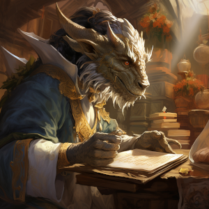
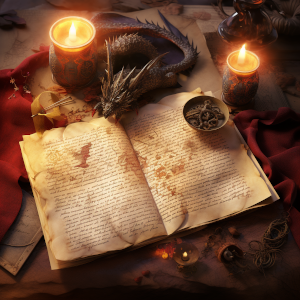

  

### Title: Comprehensive AI-Powered RPG Content Creation Suite

#### Overview
This versatile tool demonstrates an innovative approach to generating a wide range of content for role-playing games (RPGs), including quests, stories, item descriptions, and more, using advanced AI technology. It efficiently integrates rich lore and character data, optimizing the AI's processing and enhancing the storytelling experience.

#### Broad Scope and Functionality
1. **Multi-Faceted Content Generation:** Beyond quests, the tool is adept at creating immersive stories, detailed item descriptions, character backstories, and more. Each content type is tailored to fit seamlessly within the RPG's world, adding depth and variety.

2. **Efficient Lore and Data Integration:** Utilizing Python's capabilities, this suite manages and integrates optimized summaries of complex game lore. The efficient use of Python enables the tool to significantly reduce the AI's token usage, enhancing processing efficiency. This method ensures that each piece of content, from quest narratives to item descriptions, is rich in lore while maintaining AI resource utilization efficiency. Python's versatile programming features facilitate the streamlined retrieval and application of lore elements, guaranteeing consistent and dynamic storytelling tailored to various game scenarios. This balance of narrative depth with computational efficiency is ideal for creating extensive and immersive RPG content.

3. **Dynamic and Contextual Storytelling:** By leveraging OpenAI's GPT-4, the suite dynamically crafts content that is contextually aligned with the game's world and characters. This adaptive storytelling elevates the player's experience, making each interaction unique and engaging.

4. **Structured Data Management:** All generated content is organized into a JSON format, facilitating easy integration into game development workflows. This structure is key for efficient management and implementation of a vast array of content.

5. **Customizable and Scalable:** The suite's design is highly adaptable, capable of handling various types of content and scalable for more complex narrative structures, maintaining its efficiency and effectiveness.

#### Key Advantages
- **Diverse Content Creation:** Capable of generating a wide array of RPG content, enhancing overall game narrative and depth.
- **AI Efficiency:** Minimizes processing costs through strategic lore encapsulation, ensuring faster and more cost-effective operations.
- **Creative Versatility:** Offers flexibility in content types, from quests and stories to item descriptions.
- **Practical and Organized:** Streamlines content management, crucial for game development and storytelling.

#### Ideal for
- **Comprehensive Game Development:** Particularly useful for RPGs needing rich and varied narrative content.
- **Interactive Storytelling and World-Building:** Ideal for creators seeking to infuse AI innovation into their storytelling processes.
- **Efficiency in AI Narrative Generation:** Demonstrates how to effectively use AI for diverse content creation while optimizing resource usage.

#### Technologies Used
- **Python:** For scripting, AI interactions, and data management.
- **OpenAI's GPT-4:** Advanced AI engine for diverse narrative generation.
- **JSON:** Efficient format for data structuring and export.
- **Midjourney:** Storyboard Visualization using optimized lore naratives.
---

### "NPC Characterization and Quest Interaction - Tailored Dialogue Based on Race and Class"

---

 

### Meet Cleo 

>    Cleo is a captivating, elf-like enchantress, an attractive figure dwelling in the seclusion of Halnir's Cave. 
     Her ethereal beauty, marked by distinctive pink furry ears and freckles, suggest a Fey or fairy heritage. 
    Cleo skillfully intertwines intelligence and charm, using her quick wit and innocent appearance to masterfully conceal her clandestine plots. 
    Though her playful and flirty demeanor may suggest innocence, beneath her exterior lies a shrewd, calculating mind not averse to using her blades when necessary. 
    Well-educated in elven traditions and street-smart like a rogue, Cleo navigates treacherous paths with ease and resourcefulness. 
    She manipulates situations to her advantage and is known for her unexpected appearances, each arrival a blend of danger and intrigue. 
    Despite being a reluctant quest giver, she flatters her victims into her complex machinations, always plotting with acute precision.

---

#### Scenario 
> The adventurer stumbles upon Cleo in a secret cavern in Halnir's cave. Cleo is there studing some old tomes about Cleo seeks legendary cipher scrolls that are said contain the secrets to translating the language of Drak’Elri, the language of dragons. Cleo tries to persuade the player to retreive these scrolls from Halnir's cave and beyond.

| Race / Class | Quest Dialog |
|----------|-----------|
| Archai/Druid | "As the Archai druid approaches, Cleo's eyes sparkle with mischief. "Well, well, well," she purrs, her gaze playfully dancing over the vibrant striations marking the adventurer's skin. "It's not often I find a child of Su'Roa in these parts. You Archai are a rare sight, especially one as... colorful as yourself.  " She flips a page of her tome, her fox-like ears twitching in interest. "A druid, aren't you? The wild-eyed wanderer, the whisperer of winds, the tamer of torrents..." Cleo chuckles, a sound as melodic as the rustling of leaves. "You've quite the reputation, my dear."   Leaning back against the rocky cavern wall, Cleo crosses her arms, her gaze never leaving the Archai. "I have a task that might pique your interest. A... treasure hunt, if you will."   She explains about the cipher scrolls, detailing their significance and the dangers that might await. "These scrolls are said to contain secrets of the Drak’Elri, the language of dragons. Imagine, being able to converse with the mighty winged beasts, to decipher their ancient wisdom..."   Cleo's tone softens, almost wistful. "But it's not an easy task. The scrolls are hidden, tucked away in corners of the world so obscure, they've been forgotten by time."   She smiles, a dangerous glint in her eyes. "What do you say, my wild-eyed wanderer? Are you brave enough to accept this quest?"   Without waiting for an answer, Cleo flips open a worn-out map, pointing at various locations. "Here, in the depths of Halnir's cave and beyond, the scrolls await. And remember, every journey begins with a single step.""|
| Archai/Shaman |"Celebrated Shaman!" Cleo greets with a playful grin, "I have a little task that requires your unique talents. You see, no ordinary adventurer can withstand the trials that lie ahead. But you, my dear, you are no ordinary adventurer. You are an Archai, a being of valor and endurance, with a heritage rich in liberation and celebration."  She leans in, her pink furry ears twitching with anticipation. "There are scrolls, legendary cipher scrolls containing secrets to Drak’Elri, the language of dragons. They are hidden away, deep within the belly of Halnir's cave, and beyond. Quite an adventure, wouldn't you say?"   Her eyes glint with mischief as she continues. "These scrolls could unlock the mysteries that have eluded scholars for centuries. Imagine the tales you could tell, the acclaim you would receive! But of course, you are a shaman, living in every age at once... Time is but a plaything to you, isn't it?"  She chuckles, the sound echoing through the cavern. "Are you up for it, my dear Shaman? Will you brave the depths and seek out these scrolls? It's more than a quest; it's an invitation to write history itself."   Her words hang in the air, a tantalizing offer wrapped in a devious challenge.|
| Archai/Monk |"Clever Monk," Cleo purrs, her pink furry ears twitching with amusement as she leans against a stack of ancient tomes, "You Archai are an interesting lot, aren't you? Endurance, poise and a knack for attracting danger, just the type of adventurer I need for a certain...endeavor."  She pauses, her eyes gleaming with mischief, "I've come across mentions of cipher scrolls in these dusty books. Scrolls said to contain secrets of Drak’Elrin, the language of dragons. A language as ancient and enchanting as your people's history."  Her gaze flicks to the side, a playful smile tugging at the corners of her lips, "But I suppose an Archai monk, with their discipline and unwavering focus, would find such an adventure dull, am I right?"  She laughs, a sound as enchanting as the chime of wind-bells, "Perhaps, you'd prove me wrong, Traveler? Are you brave enough to descend into the depths of Halnir's cave and beyond for these scrolls? Or should I seek another who relishes danger as sport?"   Her challenge hangs in the cavern air, a blend of danger and intrigue, a lure for the adventurer to join her complex machinations.
|Human/Druid|"Ah, welcome back, wild-eyed druid," Cleo greets, her voice echoing around the cavern. Her eyes sparkle with mischief as she studies the adventurer, a playful smile tugging at her lips. "Or should I call you 'Wanderer of the Fragmented Realms'? You do have a knack for finding your way to the most unexpected places."  She moves closer, her pink furry ears twitching with curiosity. "So, you've returned to the dawn of Thronefast, have you? Seeking adventure, or perhaps, something more?" She pauses, her gaze resting on the adventurer's face. "I have a task that might pique your interest."  Cleo sweeps her hand over a collection of dusty tomes and worn scrolls, her eyes gleaming with hidden knowledge. "There are scrolls, cipher scrolls, said to contain the secrets to translating the language of Drak’Elrin - the language of dragons. They are lost, hidden, forgotten in the depths of this world. An adventurer like you might stand a chance of finding them."  Her gaze is intense, her words carefully chosen. "The Keepings of Castigue, the chronicles of Narian and Kaolyen... They were onto something, weren't they? But they hit a wall. The Dragon Accord... it's a mystery that has yet to be unraveled."  She leans back, crossing her arms. "The scrolls could be anywhere. In the bowels of Halnir's cave or beyond. It's a dangerous quest, filled with peril and uncertainty. But just imagine... the secrets you could uncover, the power you could wield. The very language of dragons at your fingertips."  Her smile widens, her tone shifting to a persuasive whisper. "So, what do you say, wild-eyed druid? Ready to delve into the fragmented realms once more and find those cipher scrolls?"|
| Human/Shaman |"Ah, you've arrived, brave Shaman," Cleo purrs, her eyes twinkling with mischief. "I've been expecting you. I've heard whispers of your travels across Terminus," she says, a teasing smile playing on her lips. "They say that you, more than any other, have the ability to bridge the chasm between the known and the unknown, the physical and the spiritual."  She gestures to the ancient tomes spread across the cavern, her fingers running over the worn covers. "You see these? They tell tales of the Dragon Accord, an artifact of unimaginable power and wisdom, but written in Drak’Elrin, the language of dragons, and so it remains an enigma to us mortals."  Her eyes meet the adventurer's, a challenge flickering within them. "But you, Shaman, you live in every age at once, drawing wisdom from the spirits of the past, present, and future. If anyone can decipher the Dragon Accord, it's you."  Cleo leans back, her gaze never leaving the adventurer's. "The journey is fraught with danger, the path uncharted. But imagine the glory, Shaman, if you succeed. Not just for you, but for all of Terminus."  She pauses, a sly grin curling her lips. "So, what do you say, brave Shaman? Will you take up this quest and change the course of history? Will you search the depths of Halnir's Cave and beyond for the cipher scrolls, unlocking the secrets of the Dragon Accord?"  "And remember," she adds with a playful wink. "In this cave, and in this quest, nothing is ever as it seems."|
|Human/Monk|Cleo, her enticing aura emanating in the dimly lit cave, greets the adventurer with a sly smile. The flickering light from the nearby torch dances upon her pink ears, highlighting the mischief in her eyes. "Ah, so the disciplined traveler has finally arrived," she says, her voice carrying a note of intrigue, "You must be the one they call the monk."  She moves in closer, her eyes scanning the adventurer with clear interest. "I've heard tales of your discipline and unwavering commitment, traveler," she continues, her gaze never wavering. "Such traits would be quite useful for the task at hand."  She then leads the adventurer towards a worn-out desk littered with ancient tomes and scrolls. She picks up a parchment, its edges charred and its content nearly illegible. "I believe you may be of help in a matter of great importance," she says, presenting the parchment to the adventurer.  "These are fragments of the Dragon Accord, written in a language lost to time. The scholars of Khadassa once helped us decipher these, but all connections with them have been severed due to growing conflicts," Cleo explains, her gaze locked onto the adventurer. "We believe the language inscribed here is Drak’Elrin, the ancient tongue of dragons. And I’ve heard... that those with a disciplined mind, like yourself, have a knack for understanding the complex."  She watches the adventurer's reaction, her eyes twinkling with anticipation. "Are you up for the challenge, traveler? Or should I seek another with the courage to delve into the unknown?" Her words hang heavily in the air, turning the once playful atmosphere into one of tension and anticipation.   She then leans back, waiting for the adventurer's decision. Her faith in their abilities is clear, but the final choice rests solely on their shoulders. Will they accept the challenge, or leave the mystery of the Dragon Accord unsolved?|

---
---

### Elandil: Updated Character Profile

 

**Name:** Elandil "The Lute Player"

**Occupation:** Musician, Informant

**Location:** Terminus, Harbor District; performs at "Lunarae Sirelë" Tavern in Faethale

**Appearance:**
- **Elven Features:** Tall and slender, with the elegant, refined features typical of elves.
- **Eyes:** Deep and observant, often reflecting a mix of wisdom and a touch of melancholy.
- **Attire:** Simple yet elegant clothes that allow ease of movement, often in earthy tones that blend with the harbor's ambiance.

**Personality:**
- **Observant and Insightful:** Elandil is not just a musician; he is an acute observer of his surroundings. His insights are often sought after by those who know his true value.
- **Artistic and Expressive:** Through his music, Elandil communicates emotions and stories more effectively than words ever could.
- **Reserved and Mysterious:** He speaks sparingly, preferring to express himself through his lute. This adds an air of mystery around him.

**Abilities:**
- **Musical Mastery:** Exceptional skill with the lute, capable of captivating or soothing his audience.
- **Information Gathering:** His unassuming presence allows him to gather information and secrets effortlessly.
- **Social Network:** Has built a network of contacts and informants throughout the harbor.

**Background:**
- **Harbor’s Confidant:** Grew up in Terminus, and his familiarity with the city makes him an invaluable resource.
- **Secrets Holder:** Over the years, Elandil has become a repository of the harbor's secrets, both mundane and critical.

**Goals/Motivation:**
- **Understanding the Pulse of Terminus:** Elandil seeks to understand and, in his way, protect the rhythms and lives within the harbor.
- **Artistic Pursuit:** His love for music and storytelling drives him, using his art to influence and reflect the world around him.

**Relationships:**
- **Connection to Janis Sova:** A complex relationship where Elandil provides information in exchange for protection or other favors for the The Dark Traders.
- **Interaction with Cleo:** Offers guidance and insight, perhaps seeing in her a part of his own journey or a chance to influence events in Terminus.

**Performance Venue: "Lunarae Sirelë" Tavern**
- **Location:** Wharf in the city of Faethale.
- **Atmosphere:** Enchanting and mystical, reflecting the allure of the moon and the sea. A place of beauty and mystery, resonating with Elandil’s ethereal music.
- **Significance:** A popular spot for both locals and travelers, providing Elandil with a diverse audience and a wealth of stories and information.

Elandil's performances at "Lunarae Sirelë" are not just entertainment; they are an integral part of the tavern's mystique. This venue adds another layer to his character, making him an iconic figure both in the harbor of Terminus and the enchanting environment of Faethale.
""" 

