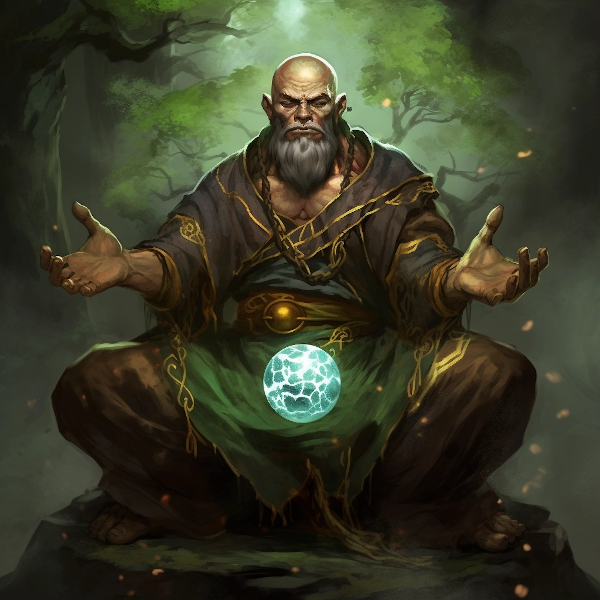

## Biography of Eron Earthweaver, the Archai Earth Monk
## Name: Eron Earthweaver

   

### Race: Archai

### Class: Monk

### Early Life and True Birth
Born on the mystical island realm of Su’Roa, Eron Earthweaver’s journey began in the ancient crystalline planet of Roa, where the Archai first emerged from the tragedies wrought upon the Aoeyn. Eron, since his early childhood, exhibited an innate connection to the earth element, a bond that was solidified during his "True Birth" ceremony. In this sacred rite, the young Eron was infused with the very essence of the earth, transforming his arcane core into a manifestation of earthly strength and resilience. His limbs, reminiscent of thick, sturdy branches, and his deep, smooth voice became symbols of his profound connection to the earth.

### Path to Monkhood
Eron's path to becoming a Monk was marked by a quest for harmony between body and soul. Embracing the ancient teachings of the Monk way, he dedicated himself to a life of discipline and obedience. This rigorous training transformed Eron’s already formidable Archai physique into a living weapon, a harmonious blend of physical might and spiritual depth.

### Philosophy and Mastery
Known for his enigmatic yet profound insights, Eron's teachings reflect a deep understanding of life's interconnectedness and the subtle dance of natural forces. His ability to channel and manifest chi, visible as a radiant green orb, symbolizes his mastery over the life energy that flows through all beings.

### The Warrior and the Sage
In battle, Eron is both a warrior and a sage. His massive frame, akin to a living fortress, moves with surprising dexterity, making him an unpredictable and formidable opponent. His fighting style is an embodiment of his philosophic beliefs – each movement is purposeful, each strike a balance of strength and fluidity.

### Legacy and Influence
Eron Earthweaver has become a symbol of endurance, poise, and intrepidness among the Archai. His life is a celebration of the Archai spirit – a testament to their journey from oppression to liberation. Eron’s legacy is not just in his feats of strength or wisdom but in the way he inspires his people to embrace their heritage, to find strength in their past, and to wield their unique abilities with pride and purpose.

In the realms of Terminus, Eron Earthweaver is more than an Earth Monk; he is a living embodiment of the Archai spirit – a beacon of hope, strength, and wisdom for all who seek to understand the true harmony between the physical and the spiritual.