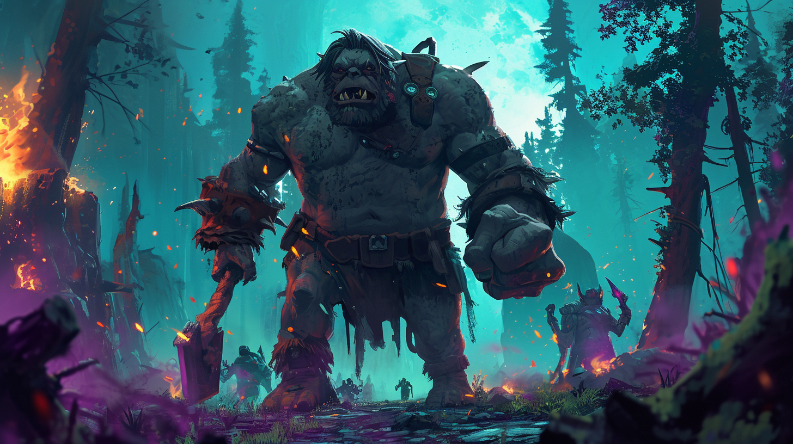

Created from the Ogre Ping.

---
## Iterating AI-Generated Racial Perception Pings
### Pantheon’s Perception System 
>This content was created using publically released lore from [Visionary Realms: Patheon: Rise of the Fallen](https://www.pantheonmmo.com/) and AI Prompt Engineering.

The following are generated "Perception Pings" for each race of Pantheon. I am painting in broad strokes to show a "Proof of Concept". With more specific lore and its intended purpose, I can focus on the narrational story arcs with greater detail and precision.  The Pings below are some basic racial history

---
 
| Race | Racial Perception Pings |
|----------|-----------|
| Archai | In the marrow of your being, you feel the ancestral weight of the Archai's trials, the icy winds of Whitethaw whispering tales of the Age of Chaos. You, a traveler born of crystalline lineage, stand upon the cusp of legend, where the shadows of warlords and the gleam of the Sanctums blend into the saga that courses through your veins. With each step across Terminus, the echoes of the Deicide War resonate beneath your feet, beckoning you to forge a path worthy of the Archai's enduring luminescence. |
| Dark Myr | Beneath the eternal twilight of your homeland, you, a Dark Myr traveler, are a silent witness to the relentless surge of history, the ebb and flow of war that have shaped the contours of your indomitable spirit. Amidst the ancient rivalries and the echoes of the Deicide War, your heart beats with the icy resolve of your people, who danced with death upon the decks of sunken Revenant armadas. You stand now, ever vigilant, a lone sentinel harboring the arcane secrets of the deep, ready to chart a path through the unknown tides of Terminus, where the whispers of fallen gods and the promise of unseen glory await your intrepid soul. |
| Dwarves | In the heart of your stout being, memories of the Deicide War stir, a time when your kin stood shoulder to shoulder with the Archai, striking out from the blinding squalls of Tenebrous Tundra. You recall the solemn oath sworn upon the crimson sands of Vesu, where the fate of nations was sealed with a pledge to stand against the darkness until the Suns of Terminus availed. Now, as you venture forth, your axe at the ready and the weight of your ancestors' valor heavy upon your shoulders, you walk the lands of Terminus, a traveler and adventurer, seeking to honor the legacy of the Dwarven people and to keep the embers of hope alive in a world that has seen the night's deepest despair. |
| Elves | In the verdant silence of Faerthale, you stand, an elf of storied lineage, the whispers of ancestral valor rustling like leaves in your mind. The Age of Chaos has dawned, and with it, the echoes of Deicide War's fury reach your keen ears, beckoning you to an adventure that will carve your name beside the Sacred Six. As you don the mantle of traveler, remember well, the world of Terminus is a tapestry of glory and ruin, and your steps tread upon the hallowed paths once washed in the blood of gods and heroes. |
| Gnomes | In the quiet of your mind, a whisper of history unfurls, telling of times when the world of Terminus was young and chaos reigned. You, a gnome of curiosity and courage, stand small but unyielding against the vastness of an age that saw gods fall and darkness spread. May your adventures be as luminous as the Suns of Terminus, guiding you through the shadowed remnants of wars long past. |
| Halflings | As you tread lightly upon the verdant hills of your homeland, the echoes of the Deicide War ripple through your halfling heart. The Sacred Six, once sundered by chaos, now whisper tales of valor and the unity that your feet may follow. You, a humble traveler, carry the light of hope and the curiosity of ages within you, as the legacy of the fallen and the valor of the WarWizards guide your every step towards the unseen horizons.
| Humans | In the age where chaos birthed legends, you, a humble human citizen, awaken amidst the remnants of a world scarred by the Deicide War, where gods and mortals clashed in a symphony of power and betrayal. Your heart beats with the legacy of the Sacred Six, and the whispers of the fallen city Havensong echo in your every step. Bearing the mantle of adventurer, you tread upon the blood-soaked lands, where each choice weaves your thread into the tapestry of Terminus' fate, a traveler destined to become a harbinger of new myths or a shadow lost to the annals of time. |
| Ogres | In the heart of the continent of Reignfall, you, an ogre citizen, feel the pulse of ancient clashes coursing through your veins. Your kind, once entangled in the brutal embrace of the Deicide War, now treads a path of adventure, a wanderer amidst the ruins of bygone valor and treachery. You carry the legacy of the Ogres of Broken Maw, their defiant spirits echoing with each step through the petrified forests and past the Pillars of Authority, guiding you towards an uncertain but grand destiny in the Age of Chaos. |
| Skar | Beneath the shroud of history, where the darkened skies of Reignfall loom, your essence stirs, O Skar traveler. You tread upon a land steeped in the blood and turmoil of ancient conflicts, the echoes of the Deicide War resonating through the very earth beneath your clawed feet. Your heart, an ember of the chaos that birthed your kin, beats with the fervor of a survivor, and the whispers of the fallen—both deity and scion—guide your path as you carve your legacy into the annals of Terminus. |
| Terminian - Generic | Thou art a traveler of Terminus, a realm baptized in the crucible of ages past, where echoes of the Deicide War still haunt the land. Carrying the legacy of the Sacred Six within thy heart, thou dost tread upon soil steeped in the blood of gods and mortals alike. The path before thee is wreathed in the mists of a history both grand and grim, beckoning thee to forge thine own legend amidst the shadows of fallen empires and the whispers of ancient magic. |

---

